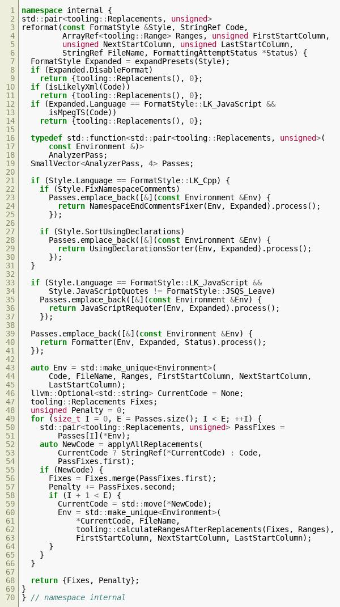
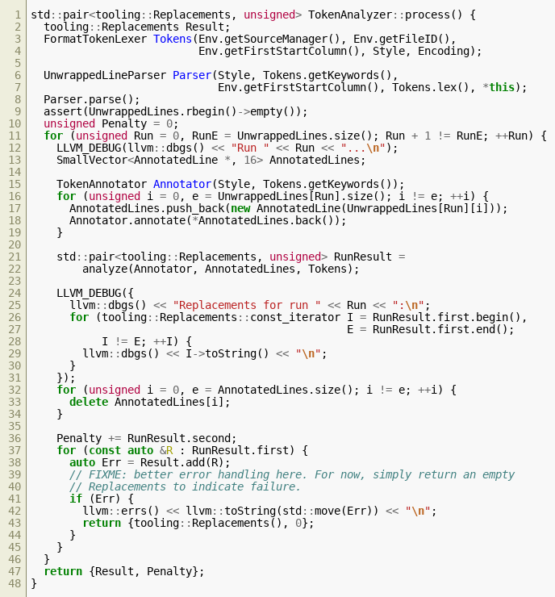

- Column limit: the biggest challenge is to adjust code to
a given column limit. Otherwise we would just pretty-print
the whole AST [1]

- Have to reformat string literals

- 🤔 Use the test cases from clang? ObjC is similar to Swift

- Here is what *clang* does. They separate 'includes'-sorting from
reformatting and apply one after the other.

- Clang also parses input tokens into an intermediate representation of
some kind

- apple/swift already has Swift lexer, which interacts with LLVM code.
This can serve as ference implementation.

### References

[1] [blog 1](http://journal.stuffwithstuff.com/2015/09/08/the-hardest-program-ive-ever-written/)

### Solution #1

TODO fill in the rest 😴

Restriction                         | Configuration
:---                                | :---
use spaces always                   | hard wrap (a.k.a. column length)
tab size 4 |
indet 4 |
cont. intent 8 |
\- keep indentents on empty lines |
\+ indent multiline strings |
\+ follow code indent in directives |
\- indent children in directives |
\! spaces before parenth. never |
\! spaces around operators always |
\! spaces before left brace always |
\! spaces before keywords always |
\+ spaces withing code braces |
\! spaces in ternary cond. oper. always |
\! spaces around colons: always after, never before |
\! spaces within type args: after comma |
\! spaces after comma; after semicolon |
